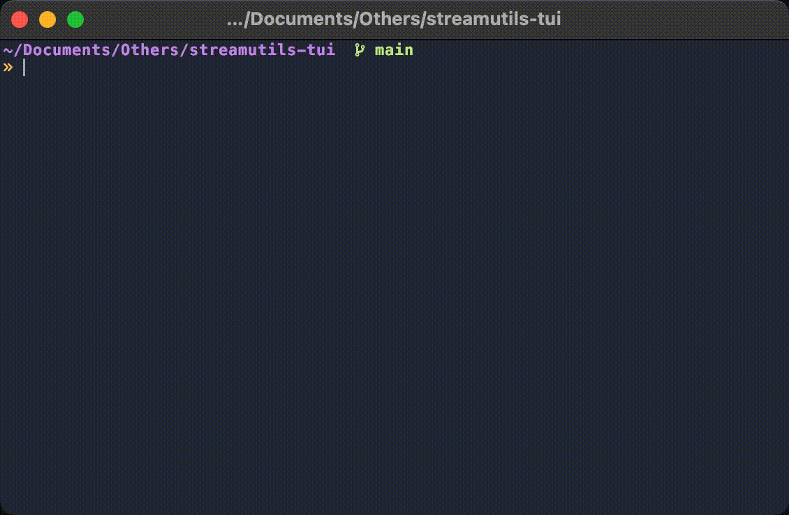

<div align="center">

# Stream Utils TUI

[](https://github.com/jcbasso/streamutils-tui/blob/main/go.mod)
[](https://github.com/jcbasso/streamutils-tui/releases)

Terminal UI application aiming to provide utils for streaming apps such as Twitch chat.


</div>

---

## Usage

```go
go run . <channel>
```

or
```go
go build
./streamutils-tui <channel>
```

> [!IMPORTANT]
> Remember to set the [environment variables](#environment-variables) before running the application.

## Environment Variables

The variables can be added in a `.env` file in the root of the project _(see `.env.local` as example)_ or as shell environment variables. The `.env` variables will not override the shell environment variables.

| Environment Variable | Required | Description                                                                                                              |
|----------------------|----------|--------------------------------------------------------------------------------------------------------------------------|
| TWITCH_OAUTH_TOKEN   | True     | Twitch User Access Token. You can obtain it from [https://twitchtokengenerator.com/](https://twitchtokengenerator.com/). |
| TWITCH_USERNAME      | True     | Username associated to previous Access Token.                                                                            |


## Development

- Use specified [go version](#stream-utils-tui).
- Follow [git branching model & release specifications](docs/git-branching-model.md).